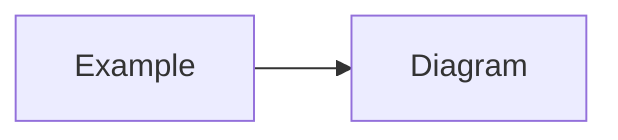

# <Short, decision-focused title>

- Status: Proposed
- Date: YYYY-MM-DD
- Deciders: <names or "repo owner + Claude Code">

## Context

<What forces are at play — technical, business, or team constraints — that make this
decision necessary? 1-3 short paragraphs. State the problem, not the solution.>

## Decision

<The decision itself, as 1-2 direct declarative sentences. "We will use X for Y."
Not a discussion — the discussion goes in Context and Alternatives Considered.>

## Diagram

<Optional. Delete this section entirely if a diagram doesn't add clarity. At most one
mermaid diagram per ADR.>

## Alternatives Considered

- **<Option A>** — <why it was rejected, one line>
- **<Option B>** — <why it was rejected, one line>

## Consequences

### Positive

- <benefit>

### Negative

- <trade-off or cost — every decision has at least one; if you can't find one, look
  harder>

## References

- <links to docs, other ADRs, upstream projects — optional, delete if none>
