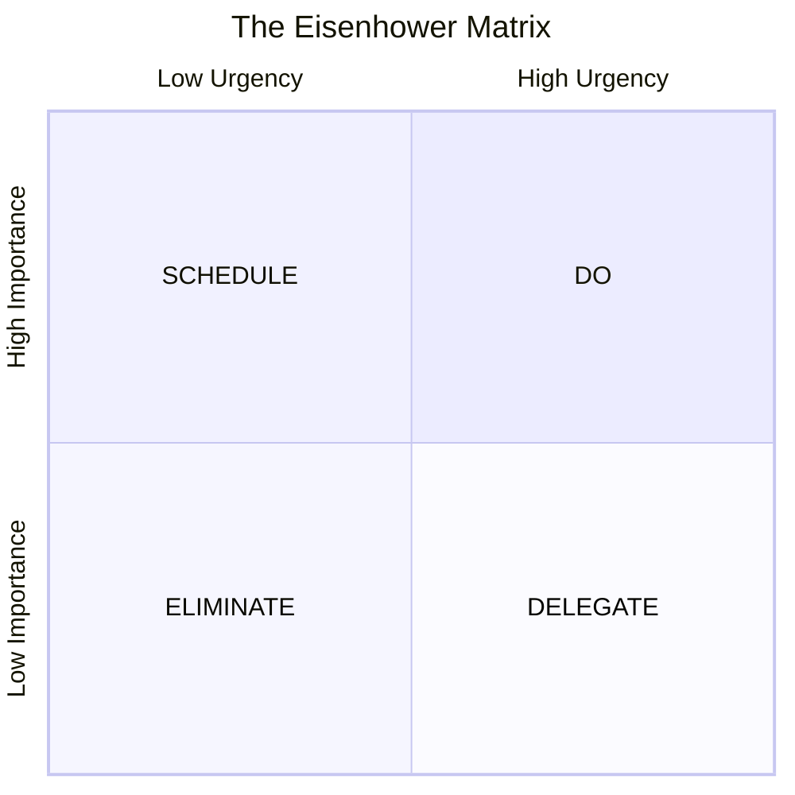

# The Eisenhower Matrix

The **Eisenhower Matrix**, also known as the **Eisenhower Decision Matrix** or **Urgent-Important Matrix**, is a powerful framework for categorizing tasks and making strategic decisions about how to spend your time and energy.

## Origins and Background

Named after **Dwight D. Eisenhower**, the 34th President of the United States and Supreme Allied Commander during World War II, this matrix stems from his famous quote:

:::note Eisenhower's Insight
> "I have two kinds of problems, the urgent and the important. The urgent are not important, and the important are never urgent."
:::

The framework was later popularized by **Stephen Covey** in his bestselling book ["The 7 Habits of Highly Effective People"](https://www.audible.com/pd/The-7-Habits-of-Highly-Effective-People-Audiobook/B002V5HAL4) and has since become a cornerstone of modern productivity methodology.

## The Eisenhower Matrix Visual

## The Four Quadrants Explained

The matrix divides tasks into four distinct categories based on two criteria: **Urgency** and **Importance**.

### Quadrant 1: DO (Urgent & Important)
**Characteristics:**
- Crises and emergencies
- Pressing problems with deadlines
- Last-minute preparations
- Crisis management

**Examples:**
- Medical emergencies
- Tax filing deadlines

**Strategy:** Handle immediately, but work to minimize time spent here through better planning.

### Quadrant 2: SCHEDULE (Important & Not Urgent)
**Characteristics:**
- Prevention and planning activities
- Relationship building
- Skill development
- Strategic thinking

**Examples:**
- Regular exercise and health maintenance
- Learning new skills

**Strategy:** This is the **golden quadrant**—focus most of your time here to prevent Quadrant 1 crises.

### Quadrant 3: DELEGATE (Urgent & Not Important)
**Characteristics:**
- Personal interruptions and distractions
- Routine errands that can be done by services
- Household tasks that can be automated or outsourced
- Social obligations that don't align with your priorities

**Examples:**
- Grocery shopping (could use delivery services)
- Minor household repairs (hire professionals)

**Strategy:** Delegate, automate, or handle quickly without overthinking.

### Quadrant 4: ELIMINATE (Not Urgent & Not Important)
**Characteristics:**
- Activities that provide no meaningful value or growth
- Habitual behaviors that consume time without purpose
- Tasks done out of procrastination or avoidance
- Activities that distract from meaningful work and relationships

**Examples:**
- Endless social media scrolling
- Organizing things that don't need organizing

**Strategy:** Eliminate these activities or severely limit them.

## The Strategic Value of Each Quadrant

### Why Quadrant 2 is Your Success Zone

Research consistently shows that highly effective people spend **65-70% of their time in Quadrant 2**. This proactive approach:

- **Prevents crises** before they become urgent
- **Builds capacity** for handling challenges
- **Creates opportunities** for growth and improvement
- **Reduces stress** through better preparation

### The Danger of Quadrants 1 and 3

Many people get trapped in what Covey calls "the urgency addiction"—constantly reacting to urgent matters without addressing underlying issues. This creates a cycle where:
- Important tasks are neglected until they become urgent
- Stress levels remain consistently high
- Long-term goals are sacrificed for short-term pressure
- Personal and professional growth stagnates

## Implementation Guidelines

### Step 1: Audit Your Current Time Usage
Track your activities for a week and categorize them into the four quadrants. This reveals your current patterns and priority blind spots.

### Step 2: Define Your "Important"
Clearly identify what "Important" means in your context:
- **Personal values** and long-term goals
- **Key relationships** and commitments  
- **Core responsibilities** at work and home
- **Health and well-being** fundamentals

### Step 3: Practice the Decision Framework
For every task or request, ask:
1. **Is this urgent?** (Time-sensitive with consequences)
2. **Is this important?** (Aligns with goals and values)
3. **Which quadrant does this belong in?**
4. **What's the appropriate action?**

## Common Pitfalls and Solutions

### Pitfall 1: Misclassifying Urgent vs. Important
**Solution:** Regularly review and challenge your classifications. Ask "Will this matter in 6 months?"

### Pitfall 2: Neglecting Quadrant 2 Activities
**Solution:** **Schedule Quadrant 2 time blocks** in your calendar before urgent tasks fill your day.

### Pitfall 3: Perfectionism in Classification
**Solution:** Make quick decisions and adjust as needed. The goal is progress, not perfection.

### Pitfall 4: Ignoring Energy Levels
**Solution:** Align high-energy times with important work, regardless of urgency.

## The Eisenhower Matrix in Modern Context

In our digital age, the matrix becomes even more relevant:

- **Information overload** makes priority setting crucial
- **Constant connectivity** blurs urgent/important boundaries  
- **Remote work** requires more intentional time management
- **AI and automation** can handle many Quadrant 3 and 4 activities

:::tip Pro Tip
The Eisenhower Matrix isn't just about task management—it's a **strategic thinking framework** that helps you align daily actions with long-term success.
:::

By mastering this timeless framework, you develop the ability to distinguish between what feels urgent and what truly matters, leading to more intentional living and sustainable productivity.

## Books and Resources

### Books and Further Reading
- ["The 7 Habits of Highly Effective People"](https://www.audible.com/pd/The-7-Habits-of-Highly-Effective-People-Audiobook/B002V5HAL4) by Stephen Covey
- ["First Things First"](https://www.audible.com/pd/First-Things-First-Audiobook/B002V8KQZC) by Stephen Covey
- ["Getting Things Done"](https://www.audible.com/pd/Getting-Things-Done-Audiobook/B01B6WSMHI) by David Allen
- ["Deep Work"](https://www.audible.com/pd/Deep-Work-Audiobook/B0189PX1RQ) by Cal Newport

### Online Resources
- [FranklinCovey Time Management Resources](https://www.franklincovey.com/solutions/productivity/)
- [MindTools: Eisenhower Matrix Guide](https://www.mindtools.com/a3csuby/the-eisenhower-principle)
- [Todoist's Guide to the Eisenhower Matrix](https://todoist.com/productivity-methods/eisenhower-matrix)
- [James Clear on Productivity](https://jamesclear.com/productivity)