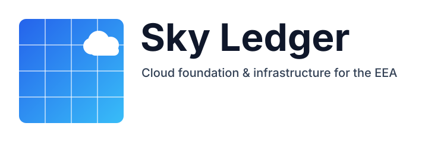

**Skyledger** is my curated knowledge base for **cloud foundation** and **infrastructure**, designed to support enterprise environments within the **European Economic Area (EEA)**. It brings together the **lessons**, **guidelines**, and **architectural decisions** gathered through hands-on practice and strategic research.

**What you'll find here:**

* Opinionated **best practices** for Azure foundations
* **Implementation patterns** & modular approaches
* **ADR summaries** and deeper architectural rationales
* Guidance on **compliance**, **identity**, **networking**, **security**, **governance**
* Common **pitfalls to avoid** in enterprise-scale landing zones

:::tip Living Knowledge Base
This space evolves as technology and platform guidance change. Revisit periodically for refined patterns.
:::

:::note Why EEA Focus?
Regional considerations such as **data residency**, **regulatory alignment (GDPR)**, and **sovereign design constraints** influence architectural choices.
:::

:::info How to Use
Skim the overview sections first, then dive into ADRs for decision context. Apply patterns incrementally—optimize for **clarity**, then **automation**, then **scale**.
:::

> **Aim:** Provide clear, practical guidance for building **robust**, **compliant**, and **scalable** cloud platforms in complex organizational settings.
