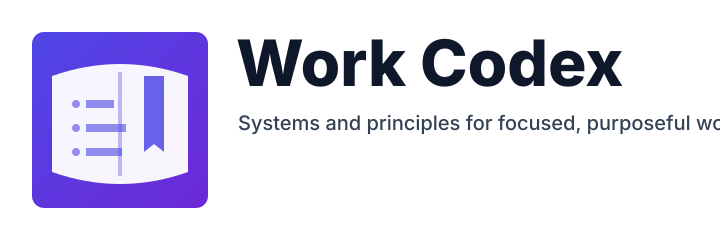

The **Work Codex** is my guide for operating with **purpose**, **clarity**, and **repeatable systems**. Its aim: shift from reactive task handling to **deliberate professional execution**. Through curated **principles**, **frameworks**, and **routines**, I reduce decision fatigue, maintain focus, and create sustainable momentum.

**What you'll find here:**

* Structured **productivity frameworks**
* Lightweight **project management patterns**
* Practical **communication guidelines**
* Sustainable **career development loops**
* Systematic approaches to **prioritization** & **focus**

:::tip Living Document
This codex evolves as I experiment with new methods and discard what doesn’t scale. Revisit to see refinements.
:::

:::note Guiding Principle
> Optimize first for **clarity**, then for **consistency**, then for **automation**.
:::

:::info How to Apply
Start with one framework (e.g., weekly planning), embed it for 2–3 cycles, then layer in the next. Avoid adopting everything at once—**compound small wins**.
:::

> **Goal:** Help you (and me) build intentional, resilient systems for a meaningful and sustainable work life.
