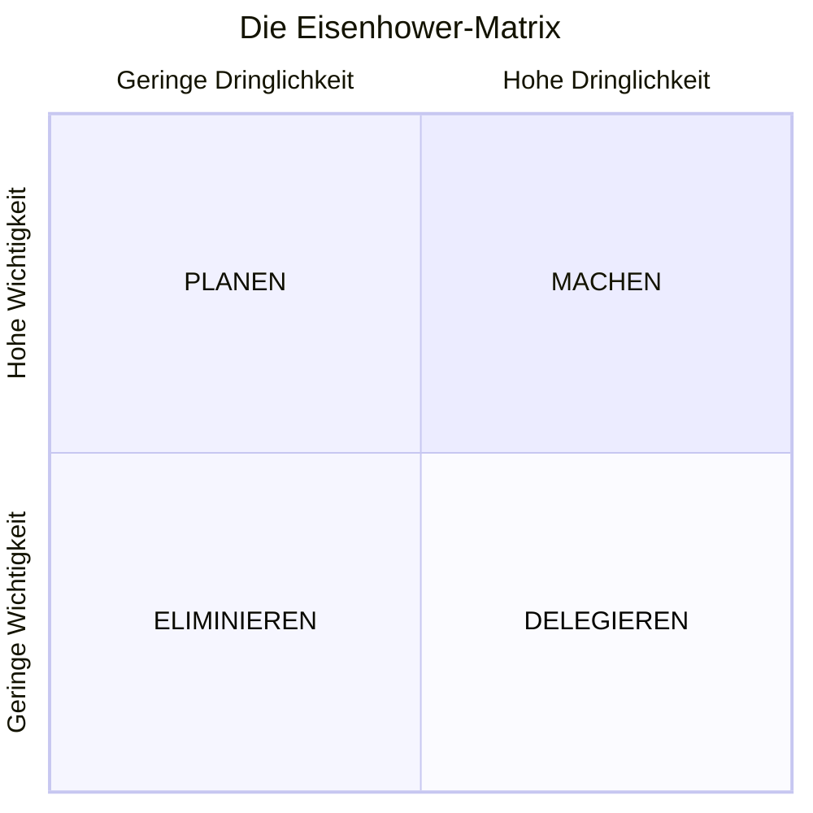

# Die Eisenhower-Matrix

Die **Eisenhower-Matrix**, auch bekannt als **Eisenhower-Entscheidungsmatrix** oder **Dringend-Wichtig-Matrix**, ist ein mächtiges Framework zur Kategorisierung von Aufgaben und strategischen Entscheidungen darüber, wie du deine Zeit und Energie verbringst.

## Ursprung und Hintergrund

Benannt nach **Dwight D. Eisenhower**, dem 34. Präsidenten der Vereinigten Staaten und Oberbefehlshaber der Alliierten während des Zweiten Weltkriegs, geht diese Matrix auf sein berühmtes Zitat zurück:

:::note Eisenhowers Erkenntnis
> "Ich habe zwei Arten von Problemen: die dringenden und die wichtigen. Die dringenden sind nicht wichtig, und die wichtigen sind niemals dringend."
:::

Das Framework wurde später von **Stephen Covey** in seinem Bestseller ["The 7 Habits of Highly Effective People"](https://www.audible.com/pd/The-7-Habits-of-Highly-Effective-People-Audiobook/B002V5HAL4) popularisiert und ist seither ein Grundstein der modernen Produktivitätsmethodik geworden.

## Die Eisenhower-Matrix Visualisierung

## Die vier Quadranten erklärt

Die Matrix teilt Aufgaben in vier verschiedene Kategorien basierend auf zwei Kriterien: **Dringlichkeit** und **Wichtigkeit**.

### Quadrant 1: MACHEN (Dringend & Wichtig)
**Eigenschaften:**
- Krisen und Notfälle
- Drängende Probleme mit Fristen
- Last-Minute-Vorbereitungen
- Krisenmanagement

**Beispiele:**
- Medizinische Notfälle
- Steuererklärungsfristen

**Strategie:** Sofort erledigen, aber durch bessere Planung die hier verbrachte Zeit minimieren.

### Quadrant 2: PLANEN (Wichtig & Nicht Dringend)
**Eigenschaften:**
- Präventions- und Planungsaktivitäten
- Beziehungsaufbau
- Kompetenzentwicklung
- Strategisches Denken

**Beispiele:**
- Regelmäßige Bewegung und Gesundheitspflege
- Neue Fähigkeiten erlernen

**Strategie:** Das ist der **goldene Quadrant** – konzentriere den Großteil deiner Zeit hierauf, um Quadrant-1-Krisen zu vermeiden.

### Quadrant 3: DELEGIEREN (Dringend & Nicht Wichtig)
**Eigenschaften:**
- Persönliche Unterbrechungen und Ablenkungen
- Routinebesorgungen, die von Dienstleistern erledigt werden können
- Haushaltsaufgaben, die automatisiert oder ausgelagert werden können
- Soziale Verpflichtungen, die nicht mit deinen Prioritäten übereinstimmen

**Beispiele:**
- Lebensmitteleinkauf (könnte Lieferdienste nutzen)
- Kleinere Hausreparaturen (Fachleute beauftragen)

**Strategie:** Delegieren, automatisieren oder schnell erledigen ohne zu überdenken.

### Quadrant 4: ELIMINIEREN (Nicht Dringend & Nicht Wichtig)
**Eigenschaften:**
- Aktivitäten, die keinen bedeutsamen Wert oder Wachstum bringen
- Gewohnheitsmäßige Verhaltensweisen, die Zeit ohne Zweck verbrauchen
- Aufgaben aus Prokrastination oder Vermeidung
- Aktivitäten, die von sinnvoller Arbeit und Beziehungen ablenken

**Beispiele:**
- Endloses Scrollen in sozialen Medien
- Dinge organisieren, die keine Organisation brauchen

**Strategie:** Diese Aktivitäten eliminieren oder stark begrenzen.

## Der strategische Wert jedes Quadranten

### Warum Quadrant 2 deine Erfolgszone ist

Forschungen zeigen durchgehend, dass hocheffektive Menschen **65-70% ihrer Zeit in Quadrant 2** verbringen. Dieser proaktive Ansatz:

- **Verhindert Krisen**, bevor sie dringend werden
- **Baut Kapazitäten auf** für den Umgang mit Herausforderungen
- **Schafft Möglichkeiten** für Wachstum und Verbesserung
- **Reduziert Stress** durch bessere Vorbereitung

### Die Gefahr der Quadranten 1 und 3

Viele Menschen geraten in das, was Covey "die Dringlichkeitssucht" nennt – ständig auf dringende Angelegenheiten reagieren, ohne die zugrundeliegenden Probleme anzugehen. Dies schafft einen Kreislauf, in dem:
- Wichtige Aufgaben vernachlässigt werden, bis sie dringend werden
- Das Stressniveau durchgehend hoch bleibt
- Langfristige Ziele für kurzfristigen Druck geopfert werden
- Persönliches und berufliches Wachstum stagniert

## Umsetzungsrichtlinien

### Schritt 1: Deine aktuelle Zeitnutzung prüfen
Verfolge eine Woche lang deine Aktivitäten und kategorisiere sie in die vier Quadranten. Dies deckt deine aktuellen Muster und Prioritäten-Blindflecken auf.

### Schritt 2: Dein "Wichtiges" definieren
Identifiziere klar, was "Wichtig" in deinem Kontext bedeutet:
- **Persönliche Werte** und langfristige Ziele
- **Schlüsselbeziehungen** und Verpflichtungen  
- **Kernverantwortlichkeiten** bei der Arbeit und zu Hause
- **Gesundheit und Wohlbefinden** Grundlagen

### Schritt 3: Das Entscheidungsframework praktizieren
Stelle für jede Aufgabe oder Anfrage folgende Fragen:
1. **Ist das dringend?** (Zeitsensitiv mit Konsequenzen)
2. **Ist das wichtig?** (Stimmt mit Zielen und Werten überein)
3. **In welchen Quadranten gehört das?**
4. **Was ist die angemessene Handlung?**

## Häufige Fallstricke und Lösungen

### Fallstrick 1: Falsche Einordnung von Dringend vs. Wichtig
**Lösung:** Überprüfe und hinterfrage regelmäßig deine Klassifizierungen. Frage dich "Wird das in 6 Monaten noch wichtig sein?"

### Fallstrick 2: Quadrant-2-Aktivitäten vernachlässigen
**Lösung:** **Plane Quadrant-2-Zeitblöcke** in deinen Kalender, bevor dringende Aufgaben deinen Tag füllen.

### Fallstrick 3: Perfektionismus bei der Klassifizierung
**Lösung:** Triff schnelle Entscheidungen und pass bei Bedarf an. Das Ziel ist Fortschritt, nicht Perfektion.

### Fallstrick 4: Energielevel ignorieren
**Lösung:** Richte energiereiche Zeiten auf wichtige Arbeit aus, unabhängig von der Dringlichkeit.

## Die Eisenhower-Matrix im modernen Kontext

In unserem digitalen Zeitalter wird die Matrix noch relevanter:

- **Informationüberflutung** macht Prioritätensetzung entscheidend
- **Ständige Konnektivität** verwischt die Grenzen zwischen dringend/wichtig  
- **Remote-Arbeit** erfordert intentionelleres Zeitmanagement
- **KI und Automatisierung** können viele Quadrant-3- und 4-Aktivitäten übernehmen

:::tip Pro-Tipp
Die Eisenhower-Matrix geht nicht nur um Aufgabenmanagement – sie ist ein **strategisches Denkframework**, das dir hilft, tägliche Handlungen mit langfristigem Erfolg auszurichten.
:::

Durch die Beherrschung dieses zeitlosen Frameworks entwickelst du die Fähigkeit, zwischen dem zu unterscheiden, was sich dringend anfühlt und was wirklich wichtig ist, was zu intentionellerem Leben und nachhaltiger Produktivität führt.

## Bücher und Ressourcen

### Bücher und weiterführende Literatur
- ["The 7 Habits of Highly Effective People"](https://www.audible.com/pd/The-7-Habits-of-Highly-Effective-People-Audiobook/B002V5HAL4) by Stephen Covey
- ["First Things First"](https://www.audible.com/pd/First-Things-First-Audiobook/B002V8KQZC) by Stephen Covey
- ["Getting Things Done"](https://www.audible.com/pd/Getting-Things-Done-Audiobook/B01B6WSMHI) by David Allen
- ["Deep Work"](https://www.audible.com/pd/Deep-Work-Audiobook/B0189PX1RQ) by Cal Newport

### Online-Ressourcen
- [FranklinCovey Time Management Resources](https://www.franklincovey.com/solutions/productivity/)
- [MindTools: Eisenhower Matrix Guide](https://www.mindtools.com/a3csuby/the-eisenhower-principle)
- [Todoist's Guide to the Eisenhower Matrix](https://todoist.com/productivity-methods/eisenhower-matrix)
- [James Clear on Productivity](https://jamesclear.com/productivity)