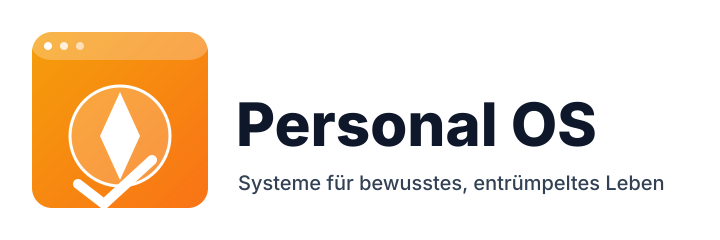

**Mein Ziel:** Ein **bewusstes und proaktives Leben** führen, statt nur auf die Umstände zu reagieren.

Dieses **Personal OS** ist mein Werkzeugkasten dafür. Ich teile hier die Systeme, Prinzipien und Routinen, die mir helfen, **Klarheit zu gewinnen** und **meine Ziele zu erreichen**.

**Was du hier findest:**
* Ansätze für mehr **Produktivität**
* Strategien zur **digitalen Organisation**
* Praktische **Finanztipps**

Alles zielt darauf ab, **mentale Unordnung zu reduzieren** und den **Fokus zu schärfen**.

:::tip Ein lebendiges Projekt
Dieses System ist nie fertig. Ich lerne ständig dazu und passe es an. Schau also gerne öfter vorbei!
:::

:::note Kernphilosophie
> Das Ziel ist nicht Perfektion—es ist **bewusstes Leben** durch systematische Ansätze, die Raum für das schaffen, was wirklich wichtig ist.
:::

Ich hoffe, diese Sammlung inspiriert dich, dein eigenes System für **zielgerichtetes Leben** zu entwickeln.