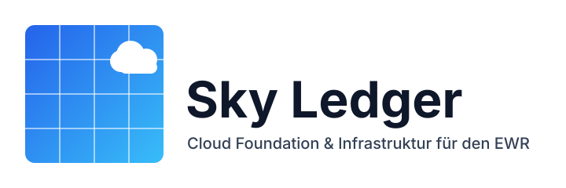

**Skyledger** ist meine kuratierte Wissensbasis für **Cloud Foundation** und **Infrastruktur**, entwickelt zur Unterstützung von Unternehmensumgebungen innerhalb des **Europäischen Wirtschaftsraums (EWR)**. Sie bündelt die **Erfahrungen**, **Leitlinien** und **Architekturentscheidungen**, die durch praktische Umsetzung und strategische Recherche entstanden sind.

**Was du hier findest:**

* Meinungsstarke **Best Practices** für Azure Foundations
* **Implementierungsmuster** & modulare Ansätze
* **ADR-Zusammenfassungen** und tiefere architektonische Begründungen
* Leitlinien zu **Compliance**, **Identity**, **Netzwerk**, **Security**, **Governance**
* Häufige **Fallstricke**, die es in Enterprise Landing Zones zu vermeiden gilt

:::tip Lebende Wissensbasis
Dieser Bereich entwickelt sich weiter, sobald sich Technologie und Plattform-Guidance ändern. Schau regelmäßig vorbei, um verfeinerte Muster zu sehen.
:::

:::note Warum EWR-Fokus?
Regionale Faktoren wie **Datenresidenz**, **regulatorische Vorgaben (DSGVO)** und **souveräne Architektur-Constraints** beeinflussen Entscheidungen.
:::

:::info Nutzung
Überfliege zuerst die Überblicksabschnitte und wechsle dann in die ADRs für Entscheidungskontext. Wende Muster schrittweise an – optimiere zuerst für **Klarheit**, dann **Automation**, dann **Skalierung**.
:::

> **Ziel:** Klare, praxisnahe Orientierung für den Aufbau **robuster**, **compliance-konformer** und **skalierbarer** Cloud Plattformen in komplexen Organisationsstrukturen.
